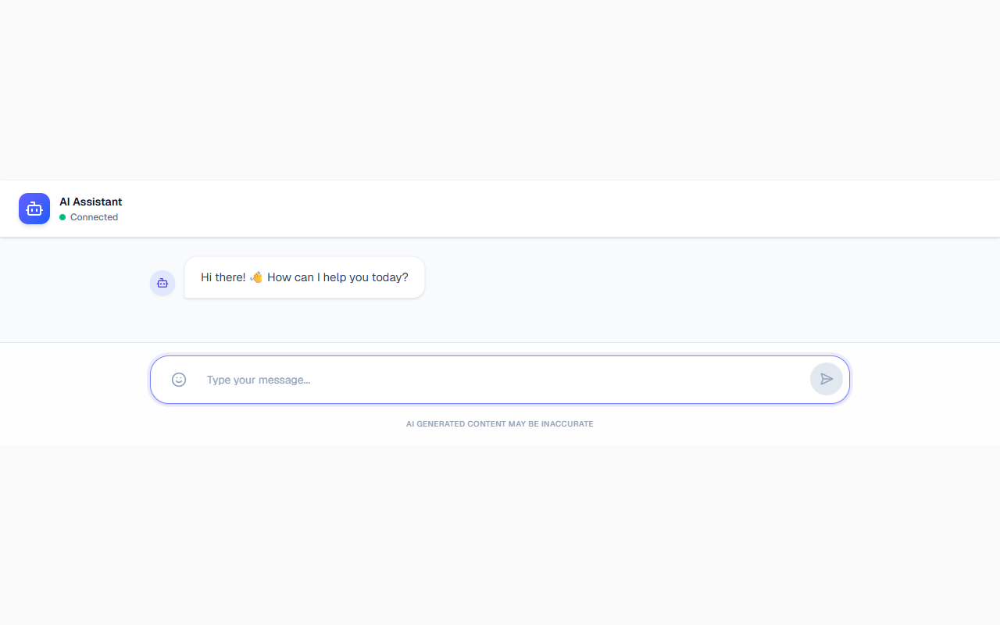
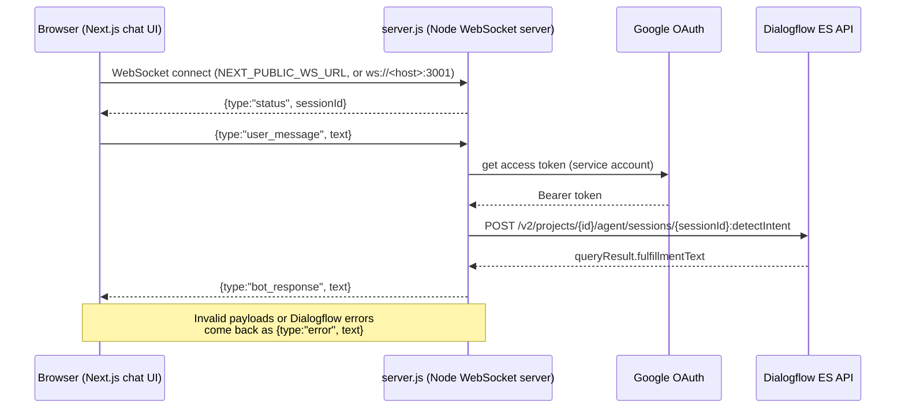

# Dialogflow Chatbot

A real-time chat UI built with Next.js. It talks to a Dialogflow ES agent through a small Node.js WebSocket server.



## Live demo: UI only

**https://dialogflow-chatbot-zeta.vercel.app** hosts the **frontend only**. The header there shows **"Disconnected"**, and you cannot chat with the bot on that page.

This is expected. Vercel runs serverless functions and cannot host a long-lived WebSocket server like `server.js`. To get a working bot, run the WebSocket server yourself (see [Getting started](#getting-started)) or deploy it to a host that supports WebSockets, such as Render, Railway or Fly.io. Then point the frontend at it with `NEXT_PUBLIC_WS_URL`. See [Deployment](#deployment).

## Features

- A chat interface with Markdown rendering (GFM and line breaks), a typing indicator, an emoji picker, copy-to-clipboard on bot replies, and auto-scroll.
- A connection status indicator (Connecting / Connected / Disconnected / error). The send button is enabled only while the socket is open.
- A WebSocket server (`server.js`) that assigns each connection its own Dialogflow session ID, so conversation context is kept per browser tab.
- Dialogflow ES `detectIntent` is called over the **REST API**, with a Google OAuth token from `google-auth-library`. The code does not use the Dialogflow client SDK.
- Service-account credentials can come from a key file path, a raw JSON environment variable, or a base64 environment variable, which suits hosts that only support env vars.
- An optional **`POST /webhook`** fulfillment endpoint on the same server. It is a sample: it replies to intents whose names contain `greeting` or `weather` and echoes everything else.

## How it works



### WebSocket message protocol

| Direction | Payload |
|---|---|
| client to server | `{ "type": "user_message", "text": "..." }` |
| server to client | `{ "type": "status", "text": "...", "sessionId": "..." }` (sent once, on connect) |
| server to client | `{ "type": "bot_response", "text": "..." }` |
| server to client | `{ "type": "error", "text": "..." }` |

## Tech stack

- **Frontend:** Next.js 16 (App Router), React 19, Tailwind CSS 4, Radix UI (Popover, ScrollArea), react-markdown, emoji-picker-react, lucide-react
- **Server:** Node.js, `ws`, `google-auth-library`, `dotenv`
- **External service:** Google Dialogflow ES (v2 REST API)

## Project structure

```
app/
  layout.tsx            root layout and page metadata
  page.tsx              renders the chat component
  components/chat.tsx   chat UI and WebSocket client
server.js               WebSocket server, Dialogflow detectIntent call, /webhook
test/server.test.js     unit tests for server message handling (node:test)
```

## Getting started

Prerequisites: Node.js 20+, and a Google Cloud project with a Dialogflow ES agent and a service account that has the *Dialogflow API Client* role.

```bash
npm install

# 1. create .env.local (git-ignored) with the variables below
# 2. start the WebSocket server (port 3001)
npm run server

# 3. in another terminal, start the UI
npm run dev        # http://localhost:3000
```

If `NEXT_PUBLIC_WS_URL` is not set, the UI connects to `ws://<current hostname>:3001`.

## Environment variables

`server.js` loads `.env.local`. **Never commit service-account keys.** The `.gitignore` already excludes `.env*` and `service-account-key.json`, and no credentials are committed to this repository.

| Name | Used by | Purpose |
|---|---|---|
| `DIALOGFLOW_PROJECT_ID` | server (required) | Google Cloud project ID of the Dialogflow ES agent |
| `DIALOGFLOW_LANGUAGE_CODE` | server | Query language, default `en-US` |
| `GOOGLE_APPLICATION_CREDENTIALS` | server | Path to a service-account JSON key file |
| `GOOGLE_SERVICE_ACCOUNT_JSON` | server | Alternative: the service-account JSON as a single-line string |
| `GOOGLE_SERVICE_ACCOUNT_BASE64` | server | Alternative: the service-account JSON, base64-encoded |
| `PORT` | server | Listen port, default `3001` |
| `NEXT_PUBLIC_WS_URL` | frontend (build time) | WebSocket server URL (`wss://...`; `https://...` is converted automatically) |

Set one of the three credential options.

## Testing

```bash
npm test     # node --test test/
npm run lint
```

The tests exercise `handleClientMessage()`, which contains the server's WebSocket message handling, with a mocked Dialogflow call. They cover the happy path, Buffer input, invalid JSON, wrong payload shapes, and Dialogflow errors. They also cover the sample webhook's intent routing. CI (GitHub Actions) runs lint, the tests and `next build` on every push.

## Deployment

- **Frontend:** Vercel, or any Next.js host. Set `NEXT_PUBLIC_WS_URL=wss://<your-ws-host>` and rebuild.
- **WebSocket server:** any host that keeps a Node process running and supports WebSocket upgrades (for example Render, Railway or Fly.io). The start command is `node server.js`. Set `DIALOGFLOW_PROJECT_ID` and pass credentials through `GOOGLE_SERVICE_ACCOUNT_BASE64`. The server reads `PORT` from the environment.

The WebSocket server is **not currently deployed**, which is why the live demo shows "Disconnected".

## Roadmap

- Deploy `server.js` to a WebSocket-capable host and connect the live demo
- Reconnect automatically when the socket drops
- Restrict the WebSocket and webhook origins (CORS is currently `*`)
